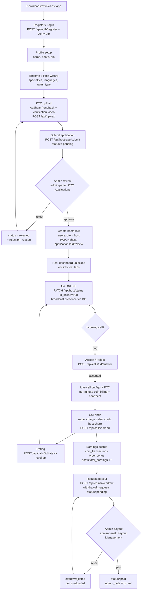
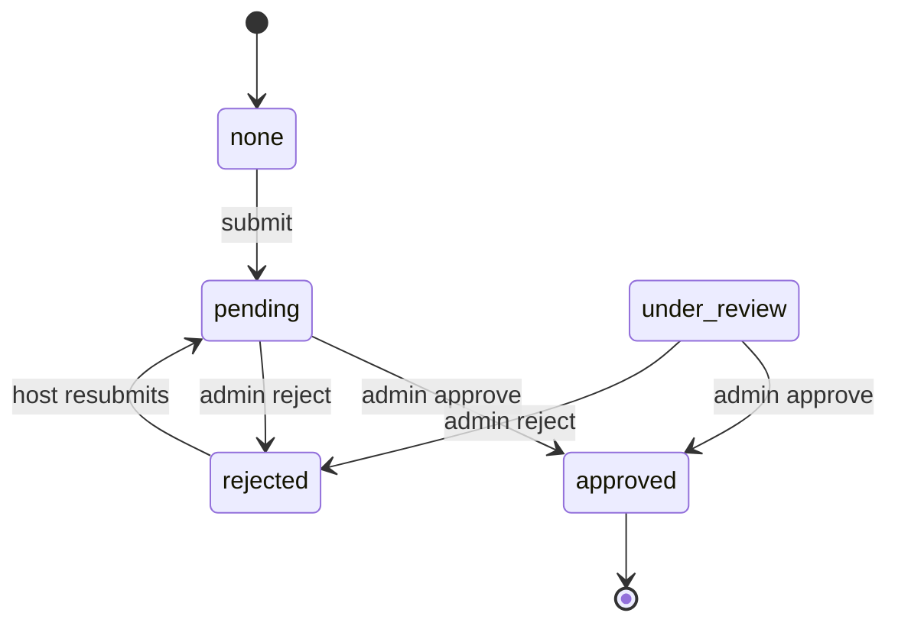
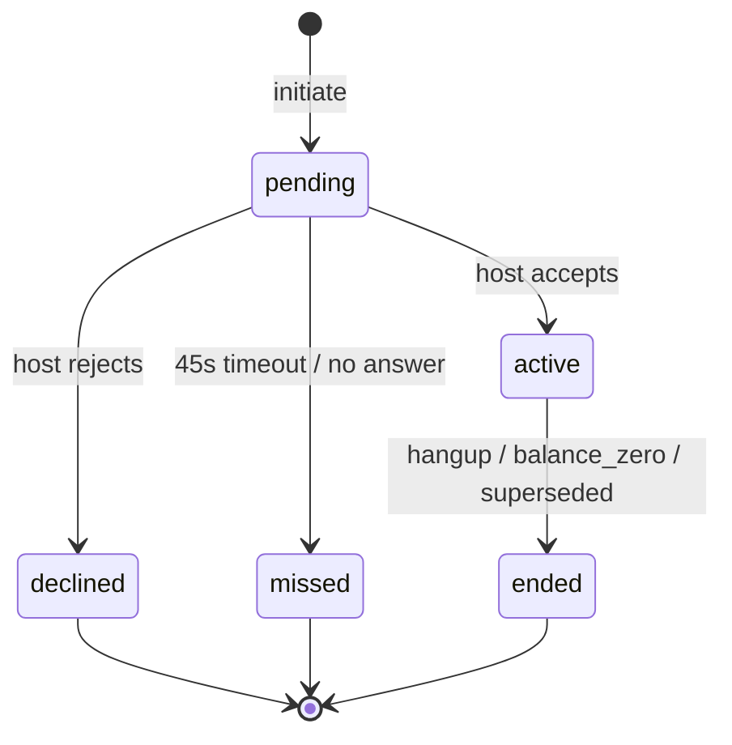
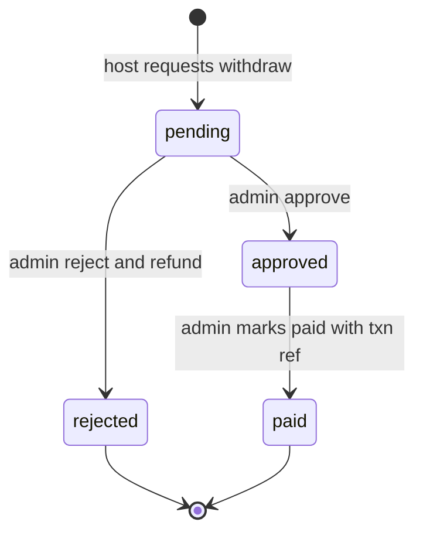
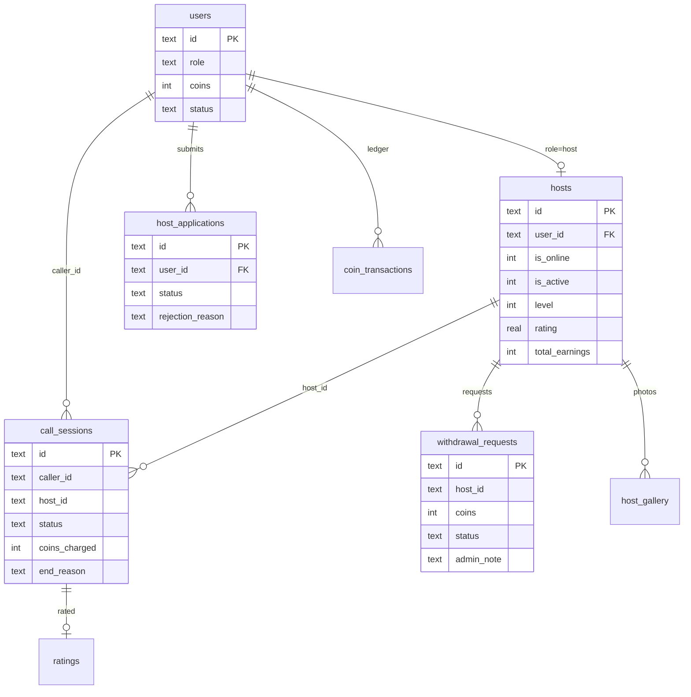

# VoxLink — Host Flow (Production Grade)

End-to-end lifecycle of a **Host** across the three surfaces:

- **`voxlink-host`** — the Host mobile app (Expo Router)
- **`api-server`** — Hono + Cloudflare Workers + D1 backend (routes under `/api/*`)
- **`admin-panel`** — the admin console (approvals, payouts, moderation)

Real-time signalling uses the **`NOTIFICATION_HUB`** Durable Object (per-user WebSocket hub) with **FCM push** as a fallback. Calls run on **Agora RTC**.

> All diagrams are Mermaid and render directly on GitHub.

---

## 1. Master lifecycle (bird's-eye view)



---

## 2. Stage-by-stage detail

### Stage 1 — Onboarding, application & KYC

| Item | Value |
|---|---|
| Host app screens | `auth/onboarding` → `auth/register` → `auth/profile-setup` → `auth/become` → `auth/kyc` → `auth/status` |
| Submit endpoint | `POST /api/host-app/submit` (`api-server/src/routes/hostapp.ts`) |
| Status polling | `GET /api/host-app/status` (polled every 10s by `auth/status.tsx`) |
| DB table | `host_applications` |
| Status values | `pending` \| `under_review` \| `approved` \| `rejected` |

**Submit validations (already enforced):** Aadhaar front+back required and must be HTTPS URLs, DOB required and age ≥ 18, `display_name` < 60 chars, bio < 1000, experience < 2000, audio/video rate 1–500. Blocks resubmission if already `approved` or `role=host`.

**Application state machine:**



> ✅ **Resolved:** the admin review endpoint (`PATCH /host-applications/:id/review`) now accepts `action=under_review`, and the admin panel has a **"Mark as Under Review"** button on pending applications. The host app's status timeline already renders this state.

**On approval** (`PATCH /api/admin/host-applications/:id/review` with `action=approve`):
1. `host_applications.status = approved`, stamps `reviewed_by` / `reviewed_at`.
2. Creates a `hosts` row (`id = host_<user_id>`) with display_name, specialties, languages, audio/video coins-per-minute.
3. Sets `users.role = host`.
4. Host app's status poll flips to `approved` → `refreshProfile()` → routes into the tabs.

---

### Stage 2 — Auth & profile

| Item | Value |
|---|---|
| Auth | `POST /api/auth/{register, verify-otp, login, refresh, logout, google-login}` |
| Host profile read | `GET /api/host/me` |
| Host profile update | `PATCH /api/host/me` (rates clamped to the host's level ceiling) |
| Gallery / intro video | `GET/POST/DELETE /api/host/gallery`, `PATCH /api/host/intro-video` |
| Host app screens | `profile/edit`, `(tabs)/profile`, `call-rates`, `manage-topics`, `gallery`, `settings`, `payout-method` |
| DB tables | `users` (role, coins, fcm_token), `hosts`, `host_gallery` |

Editable profile fields: display_name, specialties (≤10), languages (≤10), audio/video coins-per-minute, `accepts_random_calls`, `allows_video`, `payout_method` (bank/upi/paytm/phonepe), `payout_details`.

---

### Stage 3 — Availability / presence

| Item | Value |
|---|---|
| Toggle online | `PATCH /api/host/status` `{ is_online: bool }` |
| Presence fan-out | `broadcastPresence()` → host's own `NOTIFICATION_HUB` + up to 100 recent users |
| WebSocket | `context/SocketContext.tsx` + `services/SocketService.ts` (token via `Sec-WebSocket-Protocol`) |
| DB | `hosts.is_online` (indexed) |

Going online **requires a `hosts` row** — returns `404 HOST_NOT_FOUND` ("complete your KYC") otherwise. Logout auto-sets `is_online=false`.

> ⚠️ **Gap:** Presence broadcast only reaches ~100 recent users (`LIMIT 100`); does not scale to all users in real time.
> ✅ **Resolved:** the availability schedule window (`available_from/to`, `timezone`) is now **enforced** — `lib/availability.ts::isWithinAvailability` is checked at `POST /api/calls/initiate` (the universal call chokepoint, covering direct **and** random-match calls) and random matching filters out hosts outside their window. Enforcement is a safe no-op when the schedule columns/values are absent.

---

### Stage 4 — Call flow (Agora RTC, per-minute billing)

```mermaid
sequenceDiagram
    participant Caller as Caller app
    participant API as api-server calls
    participant Hub as NOTIFICATION_HUB + FCM
    participant Host as Host app
    participant Agora as Agora RTC

    Caller->>API: POST /initiate (host_id, type)
    Note over API: kill-switch, rate-limit, block/busy checks,<br/>affordability >= 120s, insert call_sessions status=pending
    API->>Hub: notify incoming_call {session_id, rate, max_seconds}
    Hub-->>Host: ring event (WS) + FCM push
    Host->>Host: incoming.tsx ring, 45s auto-decline

    alt Host accepts
        Host->>API: POST /:id/answer {accepted:true}
        Note over API: status=active, started_at=now, place coin hold
        API->>Hub: notify caller call_accepted
        Host->>API: GET /:id/agora-token
        Caller->>API: GET /:id/agora-token
        API-->>Host: {app_id, channel=sessionId, token}
        API-->>Caller: {app_id, channel=sessionId, token}
        Host->>Agora: join channel (audio/video)
        Caller->>Agora: join channel
        loop every ~minute
            Caller->>API: POST /:id/heartbeat
            Note over API: server-side balance cap;<br/>force-end on balance_zero, warn on low balance
        end
    else Host rejects / timeout
        Host->>API: POST /:id/answer {accepted:false}
        API->>Hub: notify caller call_declined
    end

    Caller->>API: POST /:id/end (or sendBeacon on unload)
    Note over API: charge caller (spend), credit host share (bonus),<br/>hosts.total_minutes/earnings++, release hold, stamp end_reason
    API->>Hub: notify both call_ended + coin_update
    Caller->>API: POST /:id/rate -> ratings + level up
```

**Call status state machine:**



Key endpoints (`api-server/src/routes/call.ts`): `POST /initiate`, `POST /:id/answer`, `GET /:id/agora-token`, `POST /:id/heartbeat`, `POST /:id/end`, `POST /:id/rate`, `POST /:id/media-state`, `POST /:id/quality`. Random matching lives in `match.ts` (`POST /api/match/find`, `/host-status/:id`, `/decline`).

**Billing:** minutes round up; caller charged `coins_charged` (`coin_transactions type=spend`), host credited a revenue share (`type=bonus`, default `host_revenue_share = 0.70`, scaled by level). `end_reason` is stamped (`caller_hangup` / `host_hangup` / `balance_zero` / `superseded` / `declined`).

> ⚠️ **Gap:** Agora token endpoint returns 500 if `AGORA_APP_ID` / `AGORA_APP_CERTIFICATE` secrets are unset — calls are unusable until configured. Same applies to `FIREBASE_SERVICE_ACCOUNT` (FCM) and payment webhook secrets.

---

### Stage 5 — Earnings & wallet

| Item | Value |
|---|---|
| Earnings summary | `GET /api/host/earnings` |
| Analytics | `GET /api/host/earnings/analytics` (daily/weekly/peak hours/tips) |
| Level | `GET /api/host/level` |
| Host app screens | `(tabs)/wallet`, `earnings-history`, `(tabs)/index` |
| DB | `coin_transactions` (bonus), `users.coins` (spendable), `hosts.total_earnings`, `tips` |

Coin → money uses `app_settings.coin_to_usd_rate` + static FX in `lib/currency`; balance is stored in the host's local currency.

> ⚠️ **Gap / risk:** Two divergent conversion defaults exist (`coin_to_usd_rate = 0.01` seed vs a `0.001024` fallback in `coin.ts`) — a ~10× discrepancy if not explicitly configured. **Set this explicitly before launch.**

---

### Stage 6 — Payout / withdrawal



| Item | Value |
|---|---|
| Request | `POST /api/coins/withdraw` (`coin.ts`) — min `min_withdrawal_coins` (100), **single pending request per host**, atomic debit with rollback |
| Admin list | `GET /api/admin/withdrawals`, `GET /api/admin/payouts` |
| Admin action | `PATCH /api/admin/withdrawals/:id` — reject refunds coins; `paid`/`completed` **require** `admin_note` (txn reference) |
| DB | `withdrawal_requests` (id, host_id, coins, amount, currency, payment_method, account_details, status, admin_note) |

Withdrawal requesting/approval is surfaced in the admin sidebar with live badge counts + ring alerts (see `admin-panel/src/lib/pendingAlerts.tsx`).

---

### Stage 7 — Ratings, levels & moderation

- **Ratings:** `ratings` table (unique per host+user+call). Recomputes `hosts.rating` / `review_count`, triggers `applyLevelUp`.
- **Levels:** `lib/levels.ts` is the single source — admin-configured ladder in `app_settings.level_config` drives listing rank boost, earning share, and rate ceilings. `hosts.level`.
- **Moderation:** `users.status` (`banned`/`deleted`), `PATCH /api/admin/users/:id`, `content_reports`, `user_blocks` (enforced in `/initiate` and `/match/find`), emergency kill-switches (`new_calls_paused`, `registrations_paused`). `hosts.is_active = 0` removes a host from all listings and matching.

---

## 3. Data model (host-centric)



---

## 4. Real-time event catalogue (`NOTIFICATION_HUB`)

| Event | Direction | Trigger |
|---|---|---|
| `presence` | server → users | host toggles online/offline |
| `incoming_call` | server → host | caller initiates |
| `call_accepted` | server → caller | host accepts |
| `call_declined` | server → caller | host rejects / timeout |
| `call_ended` | server → both | call settled |
| `coin_update` | server → both | balance changed after billing |
| `call_low_balance` | server → caller | heartbeat sees low remaining seconds |
| `peer_media_state` | server → peer | mic/cam toggled |

---

## 5. Production-readiness checklist

These are the gaps to close before / right after launch (ordered by risk):

- [x] **`under_review` state** — admin review endpoint accepts `action=under_review` + "Mark as Under Review" button in the panel; host-app timeline already renders it. ✅
- [x] **Availability window enforcement** — `lib/availability.ts` enforced at `/api/calls/initiate` (universal chokepoint) and filtered in `/api/match/find`; safe no-op when unset. ✅
- [x] **Coin→money rate** — verified already consolidated: `coin_value_inr` is the source of truth, the FX cron pins `coin_to_usd_rate` from it, and there is an explicit guard against the legacy `0.01`. No divergent live path. ✅
- [ ] **Secrets configured:** `AGORA_APP_ID`, `AGORA_APP_CERTIFICATE`, `FIREBASE_SERVICE_ACCOUNT`, payment webhook secrets — calls/push/deposits fail silently without them. *(deployment config, not code)*
- [ ] **Presence at scale:** the `LIMIT 100` fan-out won't notify all users; consider topic-based / on-demand presence for large user bases.
- [ ] **Call cleanup:** verify the heartbeat force-end + cron reaper reliably close sessions when a client dies mid-call (no client `/end`).
- [ ] **Payout `paid` audit:** confirm `admin_note` (txn reference) is mandatory on `paid`/`completed` (it is) and shown in audit logs.
- [ ] **Dead field cleanup:** `call_sessions.cf_session_id` (legacy Cloudflare Calls) is unused after the Agora migration.
- [ ] **`language.tsx`** host-app screen is a "Coming Soon" stub.

---

## 6. How to keep this diagram production-grade

1. **Single source of truth:** this file lives in the repo (`docs/HOST_FLOW.md`) and renders on GitHub — update it in the same PR whenever a host-facing endpoint, status value, or screen changes.
2. **Mermaid, not images:** diffable in code review, no binary assets, editable by anyone.
3. **Ground every node in real artefacts:** each box maps to a concrete endpoint / table / screen (as above) so the diagram can't silently drift from the code.
4. **State machines over prose** for `host_applications.status`, `call_sessions.status`, and `withdrawal_requests.status` — these are the states most likely to cause production bugs.
5. **Track gaps as checkboxes** (§5) so "production readiness" is measurable, not a vibe.
